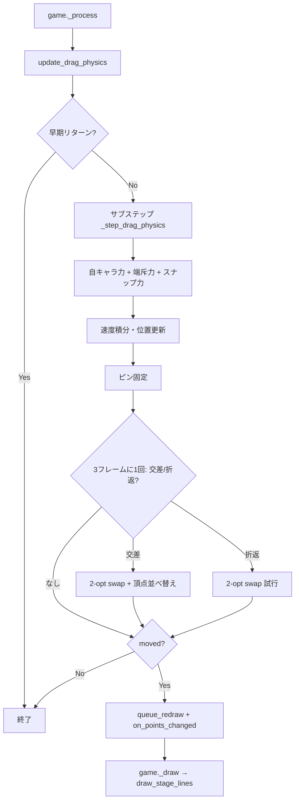

# KATA-DRAW KATA 動作仕様

> **作成日**: 2026-05-24  
> **出典**: `scripts/game.gd`、`scripts/input_handler.gd`、`scripts/stage_renderer.gd`、`scripts/ui_renderer.gd`、`scripts/stage_manager.gd`（`Docs/` 内の旧ドキュメントは未参照）  
> **対象**: プレイ中の KATA（頂点・辺・物理・描画・トポロジ修正）。ゲーム全体の概要は `KATADRAW_現行仕様.md` を参照。

---

## 目次

1. [概要](#1-概要)
2. [データ構造](#2-データ構造)
3. [初期配置](#3-初期配置)
4. [線の描画アルゴリズム](#4-線の描画アルゴリズム)
5. [再描画のトリガーとフレームループ](#5-再描画のトリガーとフレームループ)
6. [物理更新ループ](#6-物理更新ループ)
7. [自キャラと入力](#7-自キャラと入力)
8. [ガイドスナップ（アリジゴク型）](#8-ガイドスナップアリジゴク型)
9. [ピン止め（A+X 長押し）](#9-ピン止めax-長押し)
10. [トポロジ修正（交差解消・折り返し）](#10-トポロジ修正交差解消折り返し)
11. [頂点の見た目](#11-頂点の見た目)
12. [メトリクス・クリア判定との連携](#12-メトリクスクリア判定との連携)
13. [定数一覧（主要）](#13-定数一覧主要)
14. [実装ファイル](#14-実装ファイル)

---

## 1. 概要

**KATA** は、画面上の `num_points` 個の頂点（`point_positions`）を **閉曲線** として結んだプレイヤー操作対象である。

| 要素 | 役割 |
|------|------|
| `point_positions` | 各頂点のワールド座標（`Array[Vector2]`） |
| `polygon_walk_order` | 閉路の訪問順（オプション。通常プレイ中は空） |
| `InputHandler` | 自キャラの力・スナップ・交差解消など物理を担当 |
| `StageRenderer.draw_stage_lines()` | 辺（線）の描画 |
| `UIRenderer._draw_game()` | 線・頂点・塗りつぶしなど描画の統合 |

プレイヤーは **自キャラ（円）** を動かし、各頂点に **引力（X / マウス右）** または **斥力（A / マウス左）** を与えて KATA を変形する。頂点はガイド輪郭へ自動吸着し、線の交差は 2-opt により解消される。

---

## 2. データ構造

### 2.1 `game.gd`

```gdscript
var point_positions: Array[Vector2] = []
## プレイ中の KATA 辺の頂点訪問順。size==point_positions のとき有効。
var polygon_walk_order: PackedInt32Array = []
```

| 変数 | 説明 |
|------|------|
| `point_positions[i]` | 頂点 `i` の座標。配列インデックスが **デフォルトの閉路順**（`i → (i+1) % n → … → 0`） |
| `polygon_walk_order[k]` | 閉路の `k` 番目に訪れる **頂点インデックス**。サイズが `point_positions.size()` と一致し、かつ `n ≥ 3` のとき有効 |

### 2.2 閉路順の有効判定

```gdscript
func is_polygon_walk_order_active() -> bool:
    return polygon_walk_order.size() == point_positions.size() and point_positions.size() >= 3
```

- ステージ開始時: `clear_polygon_walk_order()` で **空** にリセット
- 2-opt 処理の途中で一時的に設定されるが、処理完了後は `apply_vertex_permutation_reorder_positions_from_walk_order()` により **座標配列へ焼き込み** され、walk order は再び空になる
- 通常プレイ中は **インデックス順** が閉路順として使われる

### 2.3 隣接頂点の参照

`game.get_polygon_next_vertex_index()` / `get_polygon_prev_vertex_index()` は walk order が有効ならその順序で隣接を返し、無効なら `(idx ± 1) % n` を返す。右スティックの頂点選択やドラッグ補助で使用される。

---

## 3. 初期配置

`StageManager.start_stage_with_config()` が `point_positions` を構築する。

### 3.1 共通フロー

1. `num_points` をステージ設定（`cfg["num_points"]`）から取得
2. `GameConfig.USE_SCREEN_HUD_GUIDE` が有効なら `recompute_hud_guide_layout()` でガイド輪郭を計算
3. `_rebuild_initial_points_from_hud_guide()` で図形タイプ別の初期頂点を配置
4. `calculate_metrics(point_positions)` で初回スコアを計算

### 3.2 図形タイプ別の初期配置

| ステージ | 頂点数 | 配置方針 |
|----------|--------|----------|
| 正三角形 | 3 | 頂上はガイド中心、下辺 2 点はコーナー位置（事前スナップ想定） |
| 正方形・ひし形 | 4 | 各角から重心方向へ `HUD_SPAWN_SQUARE_CORNER_INWARD` だけ内側 |
| 正六角形 | 6 | ガイド頂点より `HUD_SPAWN_HEX_OUTWARD_MUL` だけ外側（同重心） |
| 円 | `num_points` | ガイド円周上、下半分（+y 側）に角度を偏らせて配置 |
| その他 | `num_points` | ガイド重心を中心とした楕円周上に等角度配置 |

配置後:

- 多くの図形: `_finalize_hud_spawn_points_align_centroid()` で重心をガイド重心に一致させ、プレイフィールド内に収める
- 円: `_finalize_hud_spawn_points_circle_on_guide()` で円周上を維持

---

## 4. 線の描画アルゴリズム

### 4.1 呼び出し経路

```
game._draw()
  └─ ui_renderer._draw_game(vp)
       ├─ _draw_clear_fill()        # クリア時の内側塗り（線の下）
       └─ stage_renderer.draw_stage_lines()
```

### 4.2 `draw_stage_lines()` のアルゴリズム

**入力**: `point_positions`（`n` 頂点）、オプションで `polygon_walk_order`

**出力**: `n` 本の辺を `draw_line(a, b, LINE_COLOR, LINE_WIDTH, true)` で描画

```
if polygon_walk_order が有効:
    for k in 0 .. n-1:
        a = polygon_walk_order[k]
        b = polygon_walk_order[(k + 1) % n]
        線を結ぶ point_positions[a] ── point_positions[b]
else:
    for i in 0 .. n-1:
        線を結ぶ point_positions[i] ── point_positions[(i + 1) % n]
```

**描画パラメータ**（`ui_renderer.gd`）:

| 定数 | 値 | 意味 |
|------|-----|------|
| `LINE_COLOR` | `(0.26, 0.21, 0.28)` | 辺の色 |
| `LINE_WIDTH` | `5.0` px | 辺の太さ |
| アンチエイリアス | `true` | `draw_line` の第 5 引数 |

`stage_type` による分岐は現状すべて同一ロジック（インデックス順または walk order 順）。

### 4.3 クリア時の塗りつぶし

`_draw_clear_fill()` も **同じ閉路順** で `PackedVector2Array` を組み立て、`draw_colored_polygon()` で `#f23052`（50% 透過）を塗る。`game_state == "cleared"` のときのみ実行。

### 4.4 描画と物理座標の一致

`_draw_game()` 内のコメントどおり、プレイ中は **拡大変換をかけず** `point_positions` をそのまま描画する（見た目と物理が一致）。

---

## 5. 再描画のトリガーとフレームループ

Godot の `CanvasItem.queue_redraw()` → `_draw()` → `_draw_game()` の流れで線が再描画される。

### 5.1 頂点が動いたとき（即時）

`InputHandler.update_drag_physics()` の末尾:

```
if moved:
    _notify_points_changed()   # game._on_input_points_changed へ
    _game.queue_redraw()
```

`moved` は以下のいずれかで `true`:

- いずれかの頂点が `DRAG_POSITION_EPSILON`（位置変化閾値）以上動いた
- トポロジ変更（交差解消・折り返し解消）が発生した

自キャラ移動時も `process_pad()` 内で `queue_redraw()` が発行される。

### 5.2 プレイ中のアイドル時（スロットル）

`game._process()` の `playing` 分岐:

| 条件 | 動作 |
|------|------|
| パーティクルあり / ヒント表示中 / `grab_input_active` | 毎フレーム `queue_redraw()` |
| 上記以外 | `_PLAY_IDLE_REDRAW_INTERVAL`（0.05 秒 = 最大 20 fps）ごとに `queue_redraw()` |

タイマー表示など、アイドル時も最低限の再描画を維持するためのスロットルである。

### 5.3 頂点変化のコールバック

`_on_input_points_changed()`:

- スポア粒子のバースト演出
- つかみ中の移動カウント用フラグ
- メトリクス静止タイマー `_metrics_settle_timer` のリセット（`grab_input_active` 時のみ）

---

## 6. 物理更新ループ

### 6.1 呼び出し順（`game._process`）

```
input_handler.process_mouse_lerp(delta)
input_handler.update_drag_physics(delta)   # KATA 物理の本体
```

`pause_active` 時は物理・メトリクス更新をスキップする。

### 6.2 `update_drag_physics()` の概要

**早期リターン条件**（いずれも満たすとき物理をスキップ）:

- 自キャラの力が非アクティブ
- 影響半径内に頂点がいない
- 全頂点の速度がゼロ
- A+X 均等化モード非アクティブ（※現行ビルドでは `_ax_spacing_active` が常に `false` のため実質常に非該当）

**サブステップ分割**:

```
steps = max(1, ceil(delta / DRAG_STEP_MAX))   # DRAG_STEP_MAX = 1/120 秒
step_delta = delta / steps
for each step:
    moved |= _step_drag_physics(step_delta)
```

### 6.3 `_step_drag_physics()` の処理順

```
1. 力の配列 forces[n] をゼロ初期化

2. 自キャラの引力/斥力を各頂点へ加算（ロック・ピン済みはスキップ）
   └─ player_force_active なら物理アクティブマスクを構築

3. プレイフィールド端の内向き斥力

4. スナップ力
   ├─ _apply_snap_vertex_forces()    # 頂点への近接バネ + 確定吸着
   ├─ _apply_snap_spring_forces()   # 吸着済みの保持バネ
   └─ _apply_snap_separation_forces() # 未吸着同士の分離

5. 速度積分
   velocity += force * delta
   velocity *= exp(-DRAG_VELOCITY_DAMPING * delta)   # DRAG_VELOCITY_DAMPING = 9.0
   position += velocity * delta
   ビューポート内へクランプ（マージン = POINT_RADIUS）

6. ピン止め後処理
   └─ ピン済みかつスナップ有効な頂点を snap ターゲットへ強制固定

7. 交差・折り返し検出（3 フレームに 1 回）
   ├─ 内部交差あり → _resolve_intersections_2opt()
   └─ 交差なし・折り返しあり → _resolve_foldback_at_vertex()
   └─ topology_changed なら _snap_release_far_points()

8. 力非アクティブかつ速度ゼロなら全速度クリア

9. 位置変化 or topology_changed で moved=true を返す
```

### 6.4 ロック判定

`InputHandler._is_locked(idx)`:

1. `_pin_state[idx] == 1`（ピン止め）→ ロック
2. それ以外 → `stage_manager.is_locked(idx)`（現行は常に `false`）

ロック済み頂点は力の加算・速度積分・交差解消の円配置フォールバックから除外される。

---

## 7. 自キャラと入力

### 7.1 移動

| 入力 | 動作 |
|------|------|
| 左スティック / 十字キー | 自キャラ加速（`PLAYER_ACCEL`、ランプアップあり） |
| マウス | `player_position` が `_mouse_target` へ lerp 追従 |

### 7.2 頂点への力

| 入力 | モード | 定数 |
|------|--------|------|
| X / マウス右のみ | 引力（`force_mode = +1`） | `PLAYER_ATTRACT_STRENGTH = 5600` |
| A / マウス左のみ | 斥力（`force_mode = -1`） | `PLAYER_REPEL_STRENGTH = 6400` |
| B | 力オフ | — |
| A+X 同時 | ピン判定（1 秒ホールド）※力はオフ | `PIN_HOLD_DURATION_MS = 1000` |

**力の計算**（`_compute_player_force`）:

```
dist = max(|point - player|, PLAYER_MIN_FORCE_DISTANCE=8)
if dist > influence_limit: 力 = 0
falloff = (1 - dist/limit)²
direction = normalize(point - player)  ※引力時は反転
force = direction * strength * falloff² * proximity_boost
接触時は PLAYER_CONTACT_FORCE を加算
```

| パラメータ | 値 |
|------------|-----|
| 基本影響半径 | `PLAYER_FORCE_RADIUS + POINT_RADIUS`（= 128 + 9 = 137 px） |
| 静止チャージ | 自キャラ静止中に A/X を押し続けると半径が幾何級数的に拡大（最大 `EMPTY_FORCE_RADIUS_TICK_CAP` 段） |

---

## 8. ガイドスナップ（アリジゴク型）

ガイド輪郭の **頂点（コーナー）** へ頂点を吸着させるシステム。`InputHandler` 内の `_snap_*` 系が担当する。

### 8.1 状態

| 配列 | 意味 |
|------|------|
| `_snap_point_state[i]` | `0`=未吸着、`1`=吸着済み |
| `_snap_point_target[i]` | 吸着先のワールド座標 |
| `_snap_point_corner_idx[i]` | 占有しているコーナー index |
| `_snap_corner_occupant[ci]` | コーナー `ci` を占有する頂点 index（`-1`=空き） |

### 8.2 未吸着頂点（`_apply_snap_vertex_forces`）

1. **空きコーナーへの近接バネ**: 距離 `< SNAP_VERTEX_ATTRACT_RADIUS`（80 px）で `SNAP_VERTEX_APPROACH_SPRING`（30）の引力
2. **確定吸着**: 距離 `≤ SNAP_CORNER_RADIUS`（20 px）で瞬間移動・占有登録
3. **占有済みコーナーからの斥力**: 距離 `< SNAP_REPEL_RADIUS`（60 px）で二次減衰斥力

### 8.3 吸着済み頂点（`_apply_snap_spring_forces`）

- ターゲットへ `SNAP_SPRING`（80）の弱いバネ + `SNAP_DAMPING`（12）で引き戻す
- 距離 `> SNAP_RELEASE_RADIUS`（30 px）またはプレイヤー斥力で **自動解除**
- 距離 `< DRAG_POSITION_EPSILON` で位置固定・速度ゼロ

### 8.4 未吸着同士の分離（`_apply_snap_separation_forces`）

- 距離 `< SNAP_SEPARATION_DISTANCE`（18 px = 2×POINT_RADIUS）で互いに斥力
- 吸着済み頂点は対象外

### 8.5 辺スナップ（レガシー）

`_apply_guide_snap_and_repulsion()` や `_apply_snap_approach_forces()` など、旧ガイド辺スナップ系の関数が `input_handler.gd` に残存するが、**現行の `_step_drag_physics()` からは呼ばれない**。現行プレイの自動吸着は **コーナー（頂点）スナップ** が主である。

---

## 9. ピン止め（A+X 長押し）

### 9.1 発火条件

プレイ中に **A+X 同時**（またはマウス左右同時）を **1 秒間** 押し続けると `_toggle_pin_in_range()` が 1 回だけ発火する。

### 9.2 対象とトグル

- 自キャラの影響半径内にあり、かつ **スナップ吸着済み**（`_snap_point_state[i] == 1`）の頂点
- 対象が全員ピン済み → 全員解除（`sfx_pin_off`）
- 未ピンが 1 つでもあれば → 全員ピン（`sfx_pin_on`）

### 9.3 ピン中の挙動

- `_is_locked(i) == true` となり、物理力・速度更新から除外
- 毎フレーム `_snap_point_target[i]` へ位置を強制固定
- スナップが外れた場合はピンも自動解除

### 9.4 描画

`is_pinned(i)` の頂点は白い大きめの円 + 黒枠で表示（`ui_renderer` の rules デモ描画、および `_draw_game` 内のピン表示）。

---

## 10. トポロジ修正（交差解消・折り返し）

線の見た目上の **辺の交差** や **鋭角折り返し（ヘアピン）** を検出し、頂点の **接続順序** を入れ替えて解消する。

### 10.1 実行タイミング

- `_step_drag_physics()` 内、速度積分・ピン処理の **後**
- **3 フレームに 1 回**（`_ISECT_THROTTLE_EVERY = 3`）
- ロックされていない頂点が 1 つ以上あるときのみ

### 10.2 辺の定義（検出用）

| 処理 | 辺の取り方 |
|------|------------|
| `_find_first_crossing_edge_indices()` | 常に **インデックス順** `i → (i+1)%n` |
| `_polygon_edges_have_interior_intersection()` | `_get_polygon_edges_for_repulsion()`（walk order 有効時は walk 順） |
| 描画 `draw_stage_lines()` | walk order 有効時は walk 順、否则インデックス順 |

2-opt 完了後は `point_positions` が並び替えられるため、インデックス順と見た目の閉路が一致する。通常プレイ中は `polygon_walk_order` が空のことが多い。

### 10.3 交差判定

**厳密内部交差**（`_segment_intersect_strict_interior`）:

- 2 線分の交点パラメータ `t`, `u` がともに `(ε, 1-ε)` 内（`ε = 1e-4`）
- 端点共有の辺ペアはスキップ

**空間グリッド最適化**（`_polygon_edges_have_interior_intersection`）:

- セルサイズ 128 px のグリッドに辺を登録
- 同一セル内の辺ペアのみ判定（`O(n²)` → `O(n×k)`）

### 10.4 2-opt swap アルゴリズム

交差辺ペア `(ei, ej)` が見つかったとき:

```
1. ord[0..n-1] = [0, 1, 2, ..., n-1]

2. 区間 [ei+1 .. ej] の ord を逆順に swap
   （辺 (ei→ei+1) と (ej→ej+1) の間の頂点列を反転）

3. polygon_walk_order = ord

4. apply_vertex_permutation_reorder_positions_from_walk_order()
   → point_positions を ord の順に並べ替え
   → polygon_walk_order をクリア

5. _permute_input_state_after_vertex_reorder(ord)
   → 速度・選択・スナップ状態など index 連動データを同じ置換で追従
```

**逐次解消**（`_resolve_intersections_2opt`）:

- 交差がなくなるまで繰り返し（最大 `n²` 回）
- 収束しない場合、非 circle ステージかつ未ロック頂点があれば **フォールバック**: 自キャラ周囲半径 `PLAYER_CROSS_RESOLVE_RADIUS`（64 px）の円周へ等角度配置

### 10.5 折り返し（ヘアピン）検出

幾何交差では検出できないが、視覚的に交差に見えるケースを補足する。

**検出**（`_find_first_foldback_vertex_index`）:

```
各頂点 k について:
  d_in  = pos[k] - pos[k-1]
  d_out = pos[k+1] - pos[k]
  dot(d_in, d_out) / (|d_in|·|d_out|) < FOLDBACK_DOT_THRESHOLD (-0.70)
  → 約 135° 以上の折り返しとみなす
```

**解消**（`_resolve_foldback_at_vertex(k)`）:

- `ei = k-2`, `ej = k+1` で 2-opt swap（`[k-1, k, k+1]` を反転）
- `k` が 0, 1, n-1 付近（ラップアラウンド必要）または `n < 5` のときはスキップ
- swap 後に新たな交差が生じた場合は **swap を取り消し**、折り返しを維持

**クールダウン**: 解消試行後 `FOLDBACK_COOLDOWN_STEPS`（18 ステップ ≒ 0.1 秒）の間、折り返し検出を抑制（チカチカ防止）。両立不可の場合は 10 倍の長いクールダウン。

### 10.6 交差解消とスナップの連携

`topology_changed == true` のとき `_snap_release_far_points()` を呼び、ターゲットから離れた吸着を解除する（交差解消による位置変化への追従）。

---

## 11. 頂点の見た目

`_draw_game()` 内で各頂点 `i` を描画する。

| 状態 | 表示 |
|------|------|
| ステージロック（現行未使用） | 半透明グレー |
| ガイド輪郭上（スナップ近傍） | 黒ディスク（`_draw_guide_snapped_point_black_disc`） |
| 通常 | `POINT_COLOR` + 精度に応じた alpha |
| フォーカス中（つかみ中） | 位置エフェクト円 |
| ピン止め | 白円 + 黒枠（`is_pinned`） |

**半径**: ガイドからの距離に応じて `POINT_RADIUS_GUIDE_NEAR_MIN`（5）〜 `POINT_RADIUS_GUIDE_FAR_MAX`（25）の間で補間。頂点間の相対ズレが大きいほどさらに `POINT_RADIUS_RELATIVE_SPREAD`（±22%）で強調。

---

## 12. メトリクス・クリア判定との連携

### 12.1 遅延計算

頂点が動くたびに `_metrics_settle_timer = 0.15` 秒がセットされる。タイマーが 0 以下になり、かつ `grab_input_active` によるリセットがないとき:

```
_calculate_metrics()
  └─ stage_manager.calculate_metrics(point_positions)  # Hausdorff ベース
_check_clear()
```

ドリフトのみの微動ではタイマーをリセットしない設計（永久にメトリクスが発火しないのを防ぐ）。

### 12.2 スコアと KATA の関係

- `current_circularity`: 実現率（`input_handler.get_snap_score() * 100` も参照）
- 辺ごとの Hausdorff 距離でガイド輪郭との一致度を評価
- クリア: 実現率が `100 - clear_threshold`（= `clear_pct`）以上

---

## 13. 定数一覧（主要）

### 描画（`ui_renderer.gd`）

| 定数 | 値 |
|------|-----|
| `POINT_RADIUS` | 9.0 px |
| `LINE_WIDTH` | 5.0 px |
| `LINE_COLOR` | (0.26, 0.21, 0.28) |

### 物理（`input_handler.gd`）

| 定数 | 値 |
|------|-----|
| `DRAG_STEP_MAX` | 1/120 秒 |
| `DRAG_VELOCITY_DAMPING` | 9.0 |
| `PLAYER_FORCE_RADIUS` | 128.0 px |
| `SNAP_CORNER_RADIUS` | 20.0 px |
| `SNAP_RELEASE_RADIUS` | 30.0 px |
| `FOLDBACK_DOT_THRESHOLD` | -0.70 |
| `_ISECT_THROTTLE_EVERY` | 3 フレーム |
| `_METRICS_SETTLE_DELAY` | 0.15 秒（`game.gd`） |
| `_PLAY_IDLE_REDRAW_INTERVAL` | 0.05 秒（`game.gd`） |

---

## 14. 実装ファイル

| ファイル | 担当 |
|----------|------|
| `scripts/game.gd` | `point_positions`、`polygon_walk_order`、メインループ、メトリクス |
| `scripts/input_handler.gd` | 自キャラ、KATA 物理、スナップ、交差解消 |
| `scripts/stage_renderer.gd` | `draw_stage_lines()` ほかステージ描画 |
| `scripts/ui_renderer.gd` | `_draw_game()`、頂点描画、クリア塗り |
| `scripts/stage_manager.gd` | 初期配置、ガイドレイアウト、`calculate_metrics()` |

---

## 付録: 処理フロー図



---

## 付録: レガシーコード（現行ループ未使用）

以下は `input_handler.gd` に定義があるが、**現行の `_step_drag_physics()` からは呼ばれない**。

| 関数群 | 元の目的 |
|--------|----------|
| `_apply_point_pair_repulsion` | 頂点同士の斥力 |
| `_apply_point_edge_repulsion` | 頂点と非隣接辺の斥力 |
| `_apply_polygon_ccw_order_constraint` | CCW 順序維持 |
| `_apply_guide_snap_and_repulsion` | 旧ガイド辺スナップ |
| `_apply_ax_spacing_equal_spacing_repulsion` | A+X 等間隔斥力 |
| `_sync_point_indices_to_centroid_polygon_order` | 重心極角ソートによる並べ替え |

A+X 均等化の **視覚エフェクト**（ピンク円）は `is_ax_spacing_mode_active()` が `true` のときのみ表示されるが、現行では `_ax_spacing_active` を `true` にするコードパスが存在しない。
